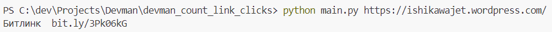
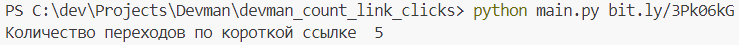

# Считаем переходы по короткой ссылке
Программа позволяет сокращать длинные ссылки и получать статистику кликов по коротким ссылкам с помощью сервиса [bitly](https://app.bitly.com).   
Если пользователь указал короткую ссылку, то программа выводит статистку кликов. Если указал длинную, то программа выдает для нее короткую ссылку.

## Как установить


Скачайте репозиторий и установите Python пакеты из `requirements.txt`:
```bash
git clone https://github.com/AlexRikka/devman_count_link_clicks.git
cd devman_count_link_clicks
pip install -r requirements.txt
```
Для взаимодействия с API Bitly необходимо получить токен типа GENERIC ACCESS TOKEN.  Ссылка для генерации токена указана на [странице документации Bitly](https://dev.bitly.com/). Создайте в папке с проектом файл `.env` и добавьте токен в него, вот так:
```
BITLY_ACCESS_TOKEN=uz7Q2caPeEqHzj2m0aci2ppEikNWZo4hPWjNG3rD
```

Запустите скрипт в командной строке, указав вашу ссылку следующим образом:
```bash
python main.py <ваша_ссылка>
```

## Пример работы скрипта
Сократить ссылку https://ishikawajet.wordpress.com/:


Узнать количество переходов по короткой ссылке bit.ly/3Pk06kG:

